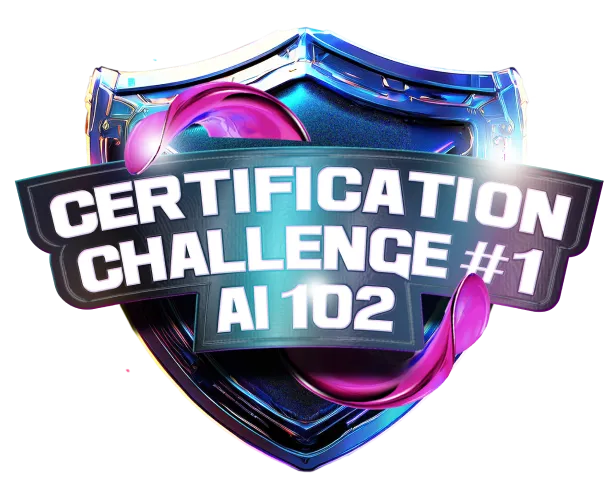

<h1> Bootcamp Microsoft Certification Challenge - AI-102 </h1>

 

*Bootcamp* EAD oferecido pela *Digital Innovation One* (DIO), em parceria com a Microsoft. Esse curso tem como objetivo preparar profissionais para a certificação AI-102 através do domínio de ferramentas Azure e soluções da Open AI para extrair dados de textos e documentos em massa. Ao mesmo tempo em que se familiariza com a plataforma Microsoft Azure, o aluno se prepara para realizar o exame de certificação com sucesso.

 

**Início**: 31/10/2024 | **Término**: 01/12/2024

**Carga Horária**: 34 horas

 

## 📝 Atividades
 

**1. Introdução à IA e IA no Azure**

* Introdução ao AI-102 com a Microsoft ✔️
* Introdução à IA e a serviços de IA do Azure ✔️
* Introdução aos serviços de IA do Azure ✔️
* Usar os serviços de IA do Azure para aplicativos empresariais ✔️
* **Desafio**: Contribuindo em um projeto *Open Source* no GitHub ✔️
* Desafios de código: aperfeiçoe sua lógica e pensamento computacional ✔️
* **Desafio**: Associando conceitos de IA com lógica de programação

 
 

**2. Criando soluções de pesquisa visual computacional com a visão de IA do Azure**
* Entendendo como funciona análise e manipulação de imagens na Azure ✔️ 
* Modelos de visão personalizada com a visão de IA do Azure ✔️ 
* Detecção de rostos com a visão de IA do Azure ✔️ 
* Trabalhando com análise de vídeos na Azure ✔️ 

 
 

**3. Desenvolvendo soluções de processamento de linguagem natural**
* Serviços de análise e tradução de texto da Azure ✔️
* Criando um banco de conhecimentos na Azure ✔️
* Criando processamento de linguagem natural na Azure ✔️
* Criando modelos de classificação personalizados na Azure ✔️
* Modelos de reconhecimento de fala, síntese e tradução na Azure ✔️
* Desafios de projeto: Crie um porrfólio vencedor ✔️
* **Desafio**: [Tradutor de artigos técnicos com AzureAI](https://github.com/biachristie/dio-bootcamp-microsoft-ai102/tree/main/Desafio_02) ✔️
* *Hands-on*: Desenvolvendo soluções de processamento de linguagem natural ✔️

 
 

**4. Desenvolvendo soluções de IA generativa com o seviço OpenAI do Azure**
* Introdução ao serviço OpenAI do Azure ✔️
* Desenvolver aplicativos com o seviço OpenAI do Azure ✔️
* Aplicar a engenharia de prompt com o serviço OpenAI do Azure ✔️
* Implementar a geração aumentada de recuperação (RAG) com o serviço OpenAI do Azure ✔️
* *Hands-on*: desenvolver soluções de IA generativa com o serviço OpenAI do Azure ✔️

 
 

**5. Criando uma solução de mineração de conhecimento**
* Utilizando o Azure AI Search para indexação e pesquisa ✔️
* Criando uma habilidade personalizada para a pesquisa de IA do Azure ✔️
* Criando repositórios de base de conhecimento na Azure ✔️
* *Hands-on*: criar uma solução de mineração de conhecimento ✔️

 
 

**6. Desenvolvendo soluções com a IA do Azure para informação de documentos**
* Criando modelos de informação de documentos na Azure ✔️
* **Desafio**: [Análise de documentos anti-fraude com Azure AI](https://github.com/biachristie/dio-bootcamp-microsoft-ai102/tree/main/Desafio_03/src) ✔️
* *Hands-on*: criando soluções com IA do Azure para gestão de documentos ✔️
* Jornada para se preparar para certificações AI-102 ✔️

 
 

**7. Simulado preparatório para o exame AI-102**
* Simulado preparatório ✔️

 
 

**8. Mentorias**
* *Live* de lançamento - *Bootcamp* Microsoft Certification Challenge AI-102 - Felipe Aguiar ✔️
* Dicas MVP Microsoft para tirar sua certificação - Valéria Baptista ✔️

 
 

## 📌 Conteúdo extra 
 

* ***E-book***: [Interpretable machine learning - a guide for making black box models explainable](https://christophm.github.io/interpretable-ml-book/index.html)
* ***Playlist* da Microsoft Reactor**: [Treinamento para AI-102](https://www.youtube.com/watch?v=3szLoAMNIWQ&list=PLmsFUfdnGr3wDswd-EB2NWcO1Eymccrlp)
* **Aula de revisão do John Savill**: [AI-102 Study Cram - Azure AI Engineer Associate Certification](https://www.youtube.com/watch?v=I7fdWafTcPY)